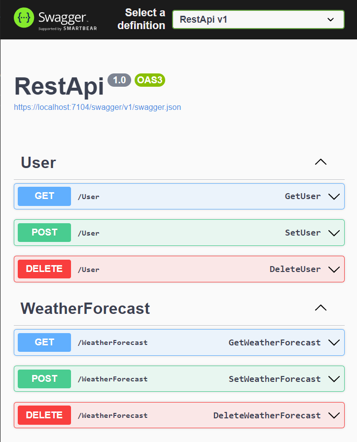
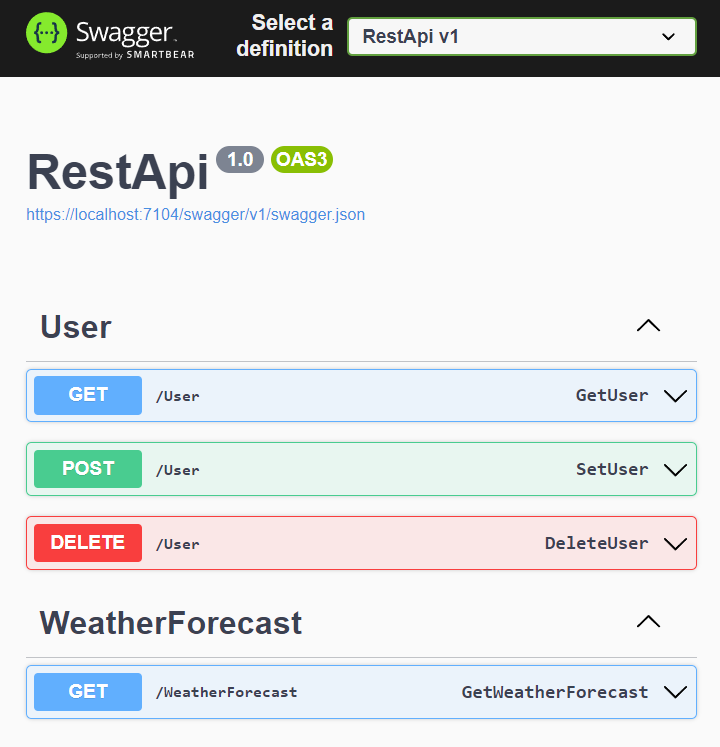
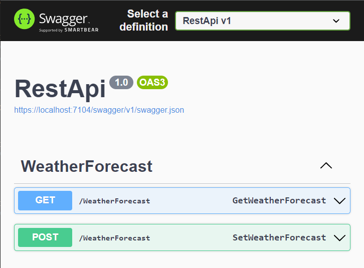
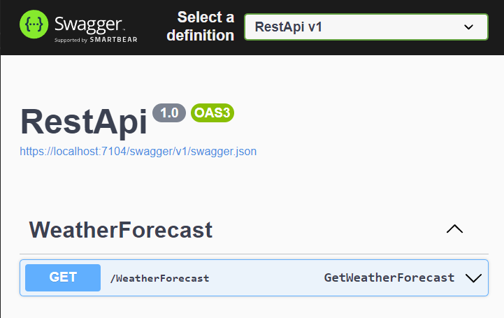

# REST API Visibility Control

Tools such a Swagger are widely used to document REST APIs. REST endpoints are grouped by controller and may have a name (OperationId).
The UI typically shows all REST endpoints, which is not always desirable.
- Hide endpoints that cannot be controlled from the UI.
- Show or hide endpoints based on application context, such as audits or experience/integration levels.
- Reduce endpoints in development for startup optimization and UI reduction.

 The following solution approach shows how to show or hide REST endpoints based on configuration.

 > 👉 Hiding an endpoint does not affect its availability; REST clients can still use it without restriction.

### Filter Configuration
Endpoint visibility is defined in the `appsettings.json` application configuration file, where visible and/or invisible filters are set. The following options are available:
- Filter on visible endpoints
- Filter on invisible endpoints
- Combined filter of visible endpoints with a subset of invisible endpoints.

The endpoint filter is an expression in `ControllerMask[.OperationMask]` format and supports `?` and `*` masks.

Examples of filter expressions:
- `WeatherForecast` - all endpoints of the `WeatherForecast` controller
- `*Audit` - all endpoints of the controller whose name ends with `Audit`
- `WeatherForecast.Get*` - all endpoints of the WeatherForecast controller whose operation name begins with `Get`.
- `*.Get*` - all endpoints whose operation name begins with `Get`.

This results in the following usage matrix:

| Mode     | Visible | Hidden | Example |
|:---|:---:|:---:|:---|
| Include  |  ✔️    | ❌     | `"VisibleItems": ["User.*", "WeatherForecast.Get*"]` |
| Exclude  | ❌     | ✔️     | `"HiddenItems": ["User.*", "WeatherForecast.DeleteWeatherForecast"]` |
| Mixed    | ✔️     | ✔️     | `"VisibleItems": ["*.Get*"],`<br />`"HiddenItems": ["User.Get*"]` |

The filters are defined in the `ApiConfiguration` section of the configuration file. Example `Include` filter:
```json
"ApiConfiguration": {
  "VisibleItems": [
    "User.*",
    "WeatherForecast.Get*"
  ]
}
```

Example `Exclude` filter:
```json
"ApiConfiguration": {
  "HiddenItems": [
    "User.*",
    "WeatherForecast.DeleteWeatherForecast"
  ]
}
```

Example of an `Include` filter combined with an `Exclude` filter:
```json
"ApiConfiguration": {
  "VisibleItems": [
    "*.Get*"
  ],
  "HiddenItems": [
    "User.Get*"
  ]
}
```

> 👉 In development mode, it is recommended that you outsource endpoint configuration to [User Secrets](https://learn.microsoft.com/en-us/aspnet/core/security/app-secrets).

### Filter Convention
ASP.NET provides the ability to define the visibility of endpoints using the [`ActionModelConvention`](https://learn.microsoft.com/en-us/dotnet/api/microsoft.aspnetcore.mvc.applicationmodels.iactionmodelconvention). The `ApiVisibilityConvention` implementation controls the visibility of the endpoint based on visible and invisible elements:

```csharp
internal sealed class ApiVisibilityConvention : IActionModelConvention
{
    private List<string> VisibleItems { get; }
    private List<string> HiddenItems { get; }

    /// <summary>
    /// Constructor
    /// </summary>
    /// <param name="visibleItems">List of visible items name masks (wildcards: *?)</param>
    /// <param name="hiddenItems">List of hidden items name masks (wildcards: *?)</param>
    internal ApiVisibilityConvention(IEnumerable<string>? visibleItems = null,
        IEnumerable<string>? hiddenItems = null)
    {
        VisibleItems = visibleItems != null ? new(visibleItems) : new();
        HiddenItems = hiddenItems != null ? new(hiddenItems) : new();
    }

    public void Apply(ActionModel action)
    {
        // visible
        if (VisibleItems.Count > 0)
        {
            action.ApiExplorer.IsVisible = VisibleItems.Any(
                x => MatchItem(action.Controller.ControllerName, GetOperationId(action), x));
        }

        // hidden
        if (HiddenItems.Count > 0)
        {
            if (VisibleItems.Count > 0)
            {
                // exclude from visible
                if (action.ApiExplorer.IsVisible == true)
                {
                    action.ApiExplorer.IsVisible = !HiddenItems.Any(
                        x => MatchItem(action.Controller.ControllerName, GetOperationId(action), x));
                }
            }
            else
            {
                action.ApiExplorer.IsVisible = !HiddenItems.Any(
                    x => MatchItem(action.Controller.ControllerName, GetOperationId(action), x));
            }
        }
    }

    private static string? GetOperationId(ActionModel action) =>
        (action.Attributes.FirstOrDefault(x => x is HttpMethodAttribute) as HttpMethodAttribute)?.Name;

    private static bool MatchItem(string controllerName, string? operationId, string mask)
    {
        var controllerMask = mask;
        string? actionMask = null;

        var actionIndex = mask.IndexOf('.');
        if (actionIndex > 0)
        {
            controllerMask = mask.Substring(0, actionIndex);
            actionMask = mask.Substring(actionIndex + 1);
        }

        // controller mask only
        if (actionMask == null || string.IsNullOrWhiteSpace(operationId))
        {
            return MatchExpression(controllerName, controllerMask);
        }

        // controller and action mask
        return MatchExpression(controllerName, controllerMask) &&
               MatchExpression(operationId, actionMask);
    }

    private static bool MatchExpression(string text, string expression)
    {
        // no mask: simple string compare
        if (!expression.Contains('?') && !expression.Contains('*'))
        {
            return string.Equals(text, expression, StringComparison.InvariantCultureIgnoreCase);
        }

        // regex
        var regex = new Regex(expression.Replace(".", "[.]").Replace("*", ".*").Replace('?', '.'));
        return regex.IsMatch(text);
    }
}
```

### Applying Endpoint Filters
The filters are read from the `ApiConfiguration` configuration at program startup and the `ApiVisibilityConvention` is registered when controllers are added:
```csharp
1 public class Program
2 {
3    public static void Main(string[] args)
4    {
5        var builder = WebApplication.CreateBuilder(args);
6
7        // configuration
8        IConfiguration Configuration = new ConfigurationBuilder()
9            .AddJsonFile("appsettings.json", optional: true, reloadOnChange: true)
10            .AddEnvironmentVariables()
11            .AddCommandLine(args)
12            .Build();
13        var apiConfiguration = Configuration.GetSection(nameof(ApiConfiguration)).Get<ApiConfiguration>();
14
15        // Add services to the container.
16        builder.Services.AddControllers(setupAction =>
17        {
18            if (apiConfiguration != null)
19            {
20                setupAction.Conventions.Add(new ApiVisibilityConvention(
21                    apiConfiguration.VisibleItems,
22                    apiConfiguration.HiddenItems));
23            }
24        });
25
26        // Learn more about configuring Swagger/OpenAPI at https://aka.ms/aspnetcore/swashbuckle
27        builder.Services.AddEndpointsApiExplorer();
28        builder.Services.AddSwaggerGen();
29
30        var app = builder.Build();
31
32        // Configure the HTTP request pipeline.
33        if (app.Environment.IsDevelopment())
34        {
35            app.UseSwagger();
36            // show operation id
37            app.UseSwaggerUI(setupAction =>
38            {
39                setupAction.DisplayOperationId();
40            });
41        }
42
43        app.UseHttpsRedirection();
44
45        app.UseAuthorization();
46
47
48        app.MapControllers();
49
50        app.Run();
51    }
52 }
```

- `8-13` - load the filter configuration
- `16-24` - apply the visibility convention
- `39` - display the operation id (optional)

If no endpoint filter is active, all available endpoints are displayed in the Web UI:
<p align="center">
    
</p>

Endpoints with the `Include` filter `"VisibleItems": ["User.*", "WeatherForecast.Get*"]`:
<p align="center">
    
</p>

Endpoints with the `Exclude` filter `"HiddenItems": ["User.*", "WeatherForecast.DeleteWeatherForecast"]`:
<p align="center">
    
</p>

Endpoints with the `Exclude` and `Include` filters `"VisibleItems": ["*.Get*"],` and `"HiddenItems": ["User.Get*"]`:
<p align="center">
    
</p>
